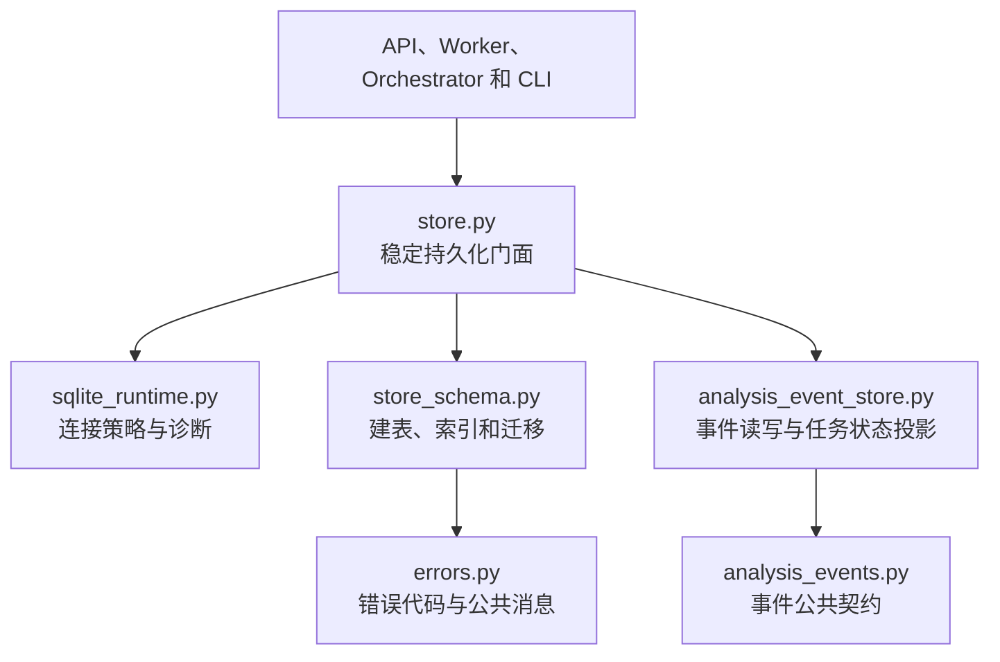

# 核心模块边界

本文记录大型核心模块渐进拆分后的实际依赖方向。每次只移动一个职责；旧模块在拆分期间继续提供兼容门面。

## 当前持久化边界

`SQLiteRunStore` 继续保留原有构造函数、属性和公共方法。数据库建表、索引和旧版本迁移由
`store_schema.ensure_main_schema()` 负责，Store 只向它传入一条已经应用统一 SQLite 策略的连接。

允许的依赖方向：

- 调用方只依赖 `store.py` 的稳定门面，不依赖 Schema 私有函数。
- `store.py` 可以依赖 `store_schema.py` 和 `sqlite_runtime.py`。
- `store_schema.py` 接收现有连接，不导入 `store.py`，不创建或缓存 SQLite 连接。
- `analysis_event_store.py` 接收连接工厂，不导入 `store.py`，普通操作每次获取新连接。
- Job 生命周期调用事件模块的 transaction-aware 写入方法，并传递现有事务连接；事件模块不得另开连接。
- Schema 迁移必须在 Worker 和其他后台线程启动前完成。
- 后续 Repository 拆分必须继续为每次操作创建独立连接；跨表原子写入必须显式共享同一事务连接。

## 兼容约束

- `refactor_agent.store.SQLiteRunStore` 和 `JobTransitionError` 的导入路径保持不变。
- Store 公共方法签名、Pydantic 记录模型和 SQLite 表结构保持不变。
- 旧数据库迁移顺序保持为 Run 迁移、Job 迁移、事件外键及其余表和索引初始化。
- 新模块不得反向导入 Store 门面，依赖图不得形成循环。

## 后续拆分方向

后续将依次提取 allowlist、Job 生命周期以及 Run/Benchmark 持久化。每完成一个边界后再更新本图；尚未提取的职责仍由 `store.py` 实现。
