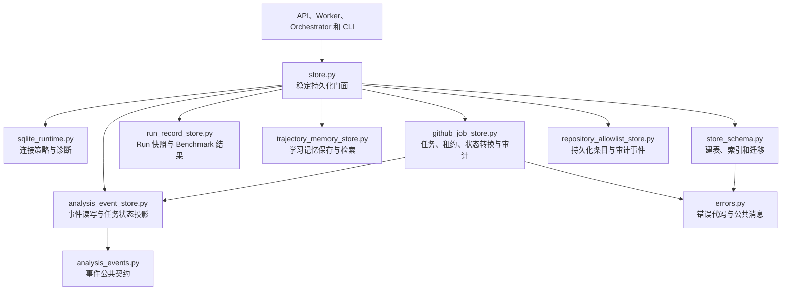
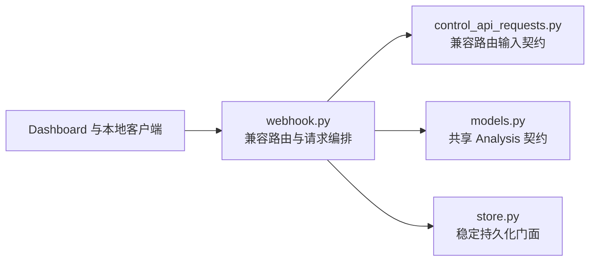

# 核心模块边界

本文记录大型核心模块渐进拆分后的实际依赖方向。每次只移动一个职责；旧模块在拆分期间继续提供兼容门面。

## 当前持久化边界

`SQLiteRunStore` 继续保留原有构造函数、属性和公共方法。数据库建表、索引和旧版本迁移由
`store_schema.ensure_main_schema()` 负责，Store 只向它传入一条已经应用统一 SQLite 策略的连接。

允许的依赖方向：

- 调用方只依赖 `store.py` 的稳定门面，不依赖 Schema 私有函数。
- `store.py` 可以依赖 `store_schema.py` 和 `sqlite_runtime.py`。
- `store_schema.py` 接收现有连接，不导入 `store.py`，不创建或缓存 SQLite 连接。
- `analysis_event_store.py` 接收连接工厂，不导入 `store.py`，普通操作每次获取新连接。
- `run_record_store.py` 独立负责完整 Run 快照和 Benchmark 结果集；Benchmark 头记录与全部案例结果在同一事务中替换，每次操作后显式关闭连接。
- `trajectory_memory_store.py` 只负责学习记忆的幂等保存、条件检索和时间排序，不负责生成 lesson 或编排运行流程；每次操作后显式关闭连接。
- `github_job_store.py` 独立负责 Job 创建、查询、租约、状态转换、完成和 `job_events` 审计，不导入 `store.py`；每次操作使用并显式关闭一条新连接。
- Job 生命周期调用事件模块的 transaction-aware 写入方法，并传递现有事务连接；Job 记录、审计事件和分析事件必须原子提交或回滚，事件模块不得另开连接。
- `repository_allowlist_store.py` 只负责持久化条目、容量上限和审计事务，不负责 URL 规范化或环境策略。
- Schema 迁移必须在 Worker 和其他后台线程启动前完成。
- 后续 Repository 拆分必须继续为每次操作创建独立连接；跨表原子写入必须显式共享同一事务连接。

## 兼容约束

- `refactor_agent.store.SQLiteRunStore` 和 `JobTransitionError` 的导入路径保持不变；后者由门面兼容导出。
- Store 公共方法签名、Pydantic 记录模型和 SQLite 表结构保持不变。
- 旧数据库迁移顺序保持为 Run 迁移、Job 迁移、事件外键及其余表和索引初始化。
- 新模块不得反向导入 Store 门面，依赖图不得形成循环。

## 当前控制 API 边界

- `control_api_requests.py` 只定义 Dashboard URL、Snippet 和 allowlist 兼容路由的 Pydantic 输入模型，不依赖 `webhook.py`、配置或业务服务。
- `AnalysisRequest` 是统一 `/analysis` 入口的共享公共模型，继续由 `models.py` 提供。
- `webhook.py` 继续兼容导出原有三个请求模型名称，调用方无需迁移导入路径。
- CLI 参数、API 路由、请求字段、默认值和响应字段保持不变。

## 后续拆分方向

Store 的业务持久化拆分已经完成，`store.py` 只保留稳定门面、SQLite 策略和模块装配。`webhook.py` 的请求模型边界也已完成；下一步将按单一边界提取任务创建逻辑，随后再处理能力声明和配置校验。
