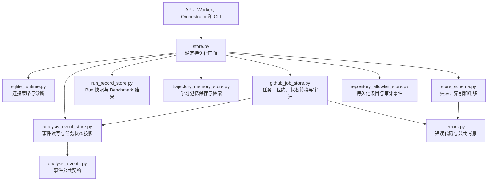
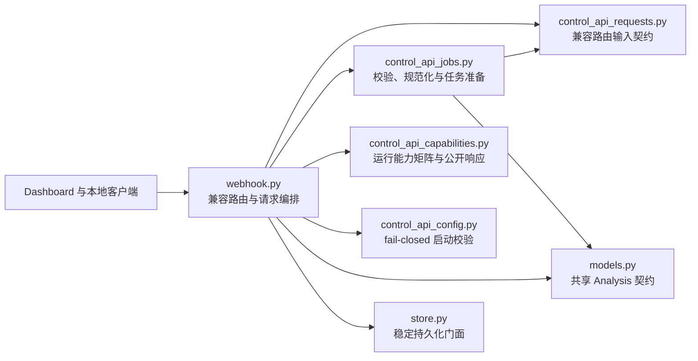
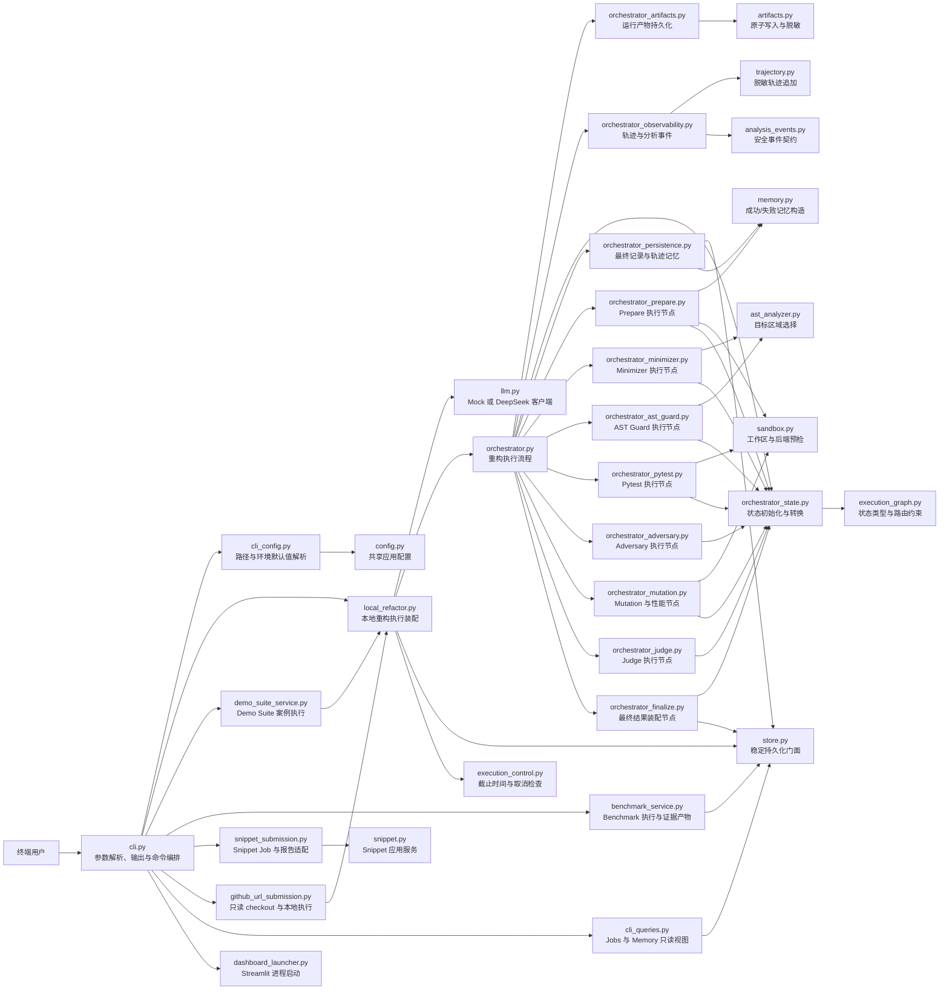

# 核心模块边界

本文记录大型核心模块渐进拆分后的实际依赖方向。每次只移动一个职责；旧模块在拆分期间继续提供兼容门面。

## 当前持久化边界

`SQLiteRunStore` 继续保留原有构造函数、属性和公共方法。数据库建表、索引和旧版本迁移由
`store_schema.ensure_main_schema()` 负责，Store 只向它传入一条已经应用统一 SQLite 策略的连接。

允许的依赖方向：

- 调用方只依赖 `store.py` 的稳定门面，不依赖 Schema 私有函数。
- `store.py` 可以依赖 `store_schema.py` 和 `sqlite_runtime.py`。
- `store_schema.py` 接收现有连接，不导入 `store.py`，不创建或缓存 SQLite 连接。
- `analysis_event_store.py` 接收连接工厂，不导入 `store.py`，普通操作每次获取新连接。
- `run_record_store.py` 独立负责完整 Run 快照和 Benchmark 结果集；Benchmark 头记录与全部案例结果在同一事务中替换，每次操作后显式关闭连接。
- `trajectory_memory_store.py` 只负责学习记忆的幂等保存、条件检索和时间排序，不负责生成 lesson 或编排运行流程；每次操作后显式关闭连接。
- `github_job_store.py` 独立负责 Job 创建、查询、租约、状态转换、完成和 `job_events` 审计，不导入 `store.py`；每次操作使用并显式关闭一条新连接。
- Job 生命周期调用事件模块的 transaction-aware 写入方法，并传递现有事务连接；Job 记录、审计事件和分析事件必须原子提交或回滚，事件模块不得另开连接。
- `repository_allowlist_store.py` 只负责持久化条目、容量上限和审计事务，不负责 URL 规范化或环境策略。
- Schema 迁移必须在 Worker 和其他后台线程启动前完成。
- 后续 Repository 拆分必须继续为每次操作创建独立连接；跨表原子写入必须显式共享同一事务连接。

## 兼容约束

- `refactor_agent.store.SQLiteRunStore` 和 `JobTransitionError` 的导入路径保持不变；后者由门面兼容导出。
- Store 公共方法签名、Pydantic 记录模型和 SQLite 表结构保持不变。
- 旧数据库迁移顺序保持为 Run 迁移、Job 迁移、事件外键及其余表和索引初始化。
- 新模块不得反向导入 Store 门面，依赖图不得形成循环。

## 当前控制 API 边界

- `control_api_requests.py` 只定义 Dashboard URL、Snippet 和 allowlist 兼容路由的 Pydantic 输入模型，不依赖 `webhook.py`、配置或业务服务。
- `control_api_jobs.py` 负责 URL/ref/路径规范化、Snippet 语法与大小校验、allowlist 准入和 `GitHubRefactorJob` 构造；它不依赖 FastAPI，不持久化任务，也不决定运行能力。
- `control_api_capabilities.py` 统一判定 Mock/DeepSeek、Docker 和提交模式可用性，并组装 `/capabilities` 的完整公开字段；它不依赖 FastAPI 或 Store 门面，也不执行启动配置校验。
- `control_api_config.py` 独立执行 allowlist 非空、Docker 后端和 Docker daemon 的 fail-closed 启动校验；它不依赖 FastAPI 或 `webhook.py`，动态 allowlist 通过显式传入的策略读取。
- `AnalysisRequest` 是统一 `/analysis` 入口的共享公共模型，继续由 `models.py` 提供。
- `webhook.py` 继续兼容导出原有三个请求模型名称，调用方无需迁移导入路径。
- `webhook.py` 和 `control_api.py` 继续兼容导出 `normalize_repo_path()`、`normalize_git_ref()`，`build_dashboard_job_id()` 也保留原有 `webhook.py` 导入路径。
- `webhook.py` 和 `control_api.py` 继续兼容导出 `validate_control_api_settings()`，调用方无需迁移导入路径。
- CLI 参数、API 路由、请求字段、默认值和响应字段保持不变。

## 当前 CLI 边界

- `local_refactor.py` 负责选择 Mock/DeepSeek、装配 Store 与 Orchestrator，并为一次本地执行创建独立的 `ExecutionControl`；它不导入 Typer、Rich、`cli.py` 或环境变量。
- `cli_config.py` 集中解析 run root、SQLite 数据库、GitHub workspace 和默认 deadline 的环境覆盖；显式命令参数优先，模块不依赖 Typer、Rich 或 `cli.py`。
- `demo_suite_service.py` 负责默认案例选择、案例物化、`RefactorRequest` 构造、Mock 戏剧化重试策略和逐案例执行；进度输出通过回调交给 CLI，不导入 Typer、Rich 或 `cli.py`。
- `benchmark_service.py` 负责内置/Manifest 路径选择、执行参数传递、历史结果对比，以及 JSON/Markdown 证据写入；CLI 只打印结果并保留原退出码。
- `snippet_submission.py` 负责 Snippet Settings 覆盖、Job 构造、`SnippetRefactorService` 调用和报告定位；CLI 保留 mode/persona、stdin/文件与 verified tests 的输入校验顺序。
- `github_url_submission.py` 负责只读 checkout、`RefactorRequest` 构造和本地执行；CLI 保留 issue 输入解析、错误展示、checkout/candidate 路径输出和退出码。
- `cli_queries.py` 负责 Jobs 与 trajectory memory 的一次性 Store 查询和稳定文本格式；它不缓存 Store 或 SQLite 连接，CLI 保留空结果提示与终端输出。
- `dashboard_launcher.py` 负责 Streamlit 依赖检测、环境副本组装和子进程执行；CLI 通过回调在启动前打印 Arena URL，并透传子进程退出码。
- `cli.py` 继续保留全部命令名称、参数、默认值和退出码，只负责参数归一化、调用应用服务以及将客户端初始化错误翻译为终端错误；运行阶段的 `LLMError` 仍按原路径传播。
- `_run_request()` 作为现有 CLI 内部兼容入口保留，调用方向只能是 `cli.py` 到 `local_refactor.py`，新服务不得反向导入 CLI。
- 原有 `_resolve_run_root()`、`_resolve_database()`、`_resolve_github_workspace_root()`、`_resolve_deadline()` 和 `_suite_mock_fail_times()` 继续由 `cli.py` 兼容导出。

## Orchestrator

- `orchestrator_artifacts.py` 只负责将一次运行的源码、测试日志、对抗测试日志、变异结果和报告写入固定产物集合。
- `orchestrator.py` 保留 `_write_artifacts()` 兼容门面并单向依赖产物模块；产物模块只依赖 `artifacts.py`，不得反向依赖 Orchestrator、Store、事件流或执行状态机。
- 每次调用创建独立 writer，采用原子替换写入，不持有跨运行、跨线程文件句柄。
- `orchestrator_observability.py` 独立负责追加脱敏轨迹并发布白名单分析事件；事件 sink 异常继续被隔离，不中断执行图。
- `orchestrator.py` 保留 `_trajectory()`、`_emit_analysis_event()` 和 `_phase_started()` 兼容门面。Observability 不导入 Orchestrator、执行图或 Store，也不创建线程和数据库连接。
- `orchestrator_state.py` 统一创建每次运行的全新初始状态，执行显式节点跳转、重试/终止判定，并收束类型化的辩论轮次。
- `orchestrator.py` 不再直接写入 `next_node`，并保留 `_retry_or_finalize()` 与 `_close_round()` 兼容门面；状态模块不依赖 Orchestrator、Store、LLM 或沙箱。
- `orchestrator_persistence.py` 根据最终状态构造稳定的 `RunRecord`，并保持“运行记录先写、trajectory memory 后写”的原有顺序；它通过窄 Store 协议工作，不持有 SQLite 连接。
- 失败轨迹、报告、产物和最终分析事件不属于该持久化边界，继续由 Orchestrator 分别调用既有独立模块。
- `orchestrator_prepare.py` 独立实现 Prepare 节点：读取历史 memory、生成 LLM 请求副本、分析基线、复制隔离工作区并执行沙箱后端预检。
- `_RefactorWorkflow.prepare()` 继续作为执行图的稳定节点入口，只发布阶段事件并委托 Prepare 模块；`_request_with_memory()` 保留兼容导出。Prepare 仅通过只读协议查询 memory，不持有 Store 或 SQLite 连接。
- `orchestrator_minimizer.py` 独立实现 Minimizer 节点：增加尝试次数、选择受控目标区域、请求候选、累积 LLM usage，并把公开化的 LLM 失败转换为 Finalize 路由。
- `_RefactorWorkflow.minimizer()` 继续作为执行图入口并发布阶段事件；Minimizer 模块通过窄 Agent 协议和轨迹回调工作，不反向依赖 Orchestrator 或 Store。
- `orchestrator_ast_guard.py` 独立实现 AST Guard 节点：受控子树重写、代码变化率、候选验证、Defender 消息、拒绝事件、轨迹及重试路由集中在该模块。
- `_RefactorWorkflow.ast_guard()` 只发布阶段事件并委托；原 `_rewrite_metadata()` 与 `_code_change_percent()` 继续作为兼容包装。
- `orchestrator_pytest.py` 独立实现 Pytest 节点：候选写入、沙箱测试、Defender 消息、通过/失败事件、失败轨迹、轮次收束与重试路由集中在该模块。
- `_RefactorWorkflow.pytest()` 只发布阶段事件并传入显式沙箱配置及 `ExecutionControl`；原 `_summarize_failure()` 保留兼容包装。
- `orchestrator_adversary.py` 独立实现 Adversary 节点：规则批评、对抗测试生成、消息与轨迹、通过/失败事件、轮次收束和重试路由集中在该模块。
- `_RefactorWorkflow.adversary()` 只发布阶段事件并传入 Agent、沙箱参数、`ExecutionControl` 与回调；三个原摘要函数保留兼容包装。
- `orchestrator_mutation.py` 独立实现 Mutation/性能节点：post 指标、组合测试目录、变异挑战、性能采样、轨迹和 Judge 路由集中在该模块。
- `_RefactorWorkflow.mutation()` 只发布阶段事件并显式传入资源限制与 `ExecutionControl`；组合路径和摘要函数保留兼容包装。
- `orchestrator_judge.py` 独立实现 Judge 节点：多目标评分、裁决元数据、轮次收束、轨迹以及重试/终止状态转换集中在该模块。
- `_RefactorWorkflow.judge()` 只发布阶段事件并传入 Judge、图后端和轨迹回调；原摘要函数保留兼容包装。
- `orchestrator_finalize.py` 独立实现 Finalize 节点：终态持久化、失败轨迹、报告/产物回调、`RefactorRunResult` 装配和最终分析事件集中在该模块。
- `_RefactorWorkflow.finalize()` 只发布阶段事件并显式注入稳定回调及运行上下文，报告渲染仍由原兼容入口提供。

## 后续拆分方向

Store、Webhook 和 CLI 的目标业务边界已经完成渐进拆分；`cli.py` 只保留参数解析、输入适配、终端展示和命令编排。Orchestrator 的运行产物、最终记录/记忆持久化、轨迹/分析事件记录和状态转换已独立定位，Prepare、Minimizer、AST Guard、Pytest、Adversary、Mutation/性能、Judge 与 Finalize 节点均已迁出；后续拆分报告渲染并完成最终验收。
